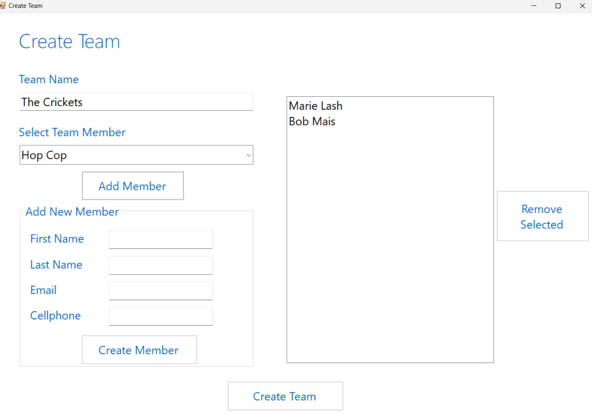
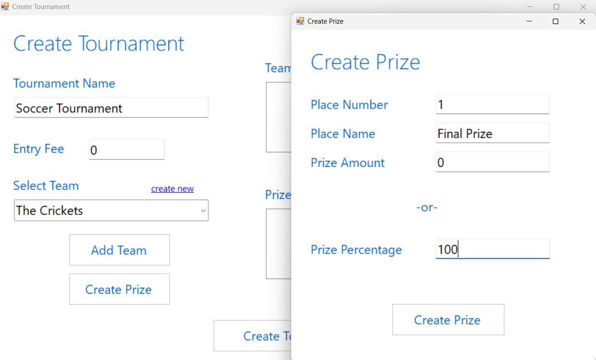
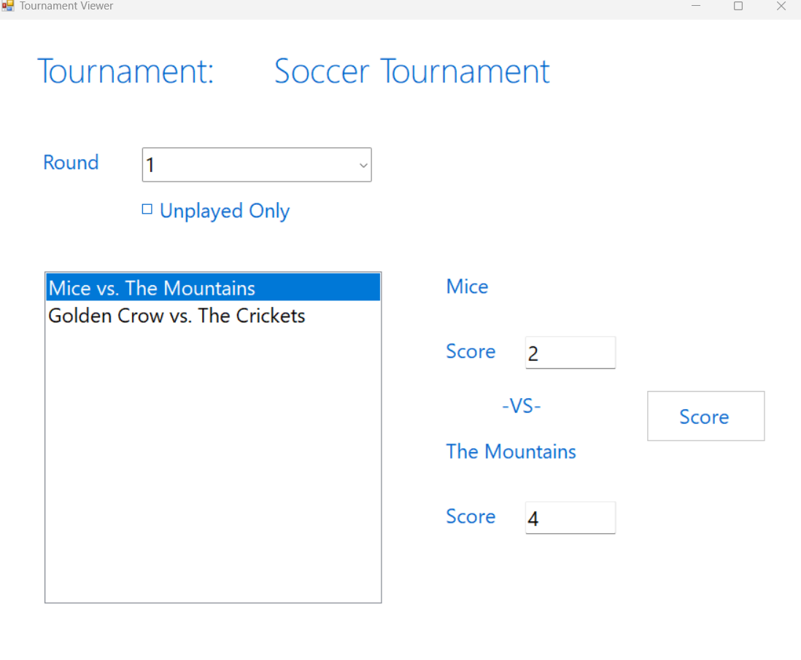

# Tournament Tracker
C# desktop application allowing users to create and play through elimination-style tournaments. Users can create teams, players, and prizes, and the application will automatically generate the rounds and randomized matchups between teams. Each team member will receive tournament and matchup information by email.

 

 

 

## Technologies used:

* C#
* UI
* SQL
* Email
* OOP

## Credits:

This is a project I made based on Tim Corey's course on [creating a C# application from start to finish](https://pages.github.com/](https://www.youtube.com/watch?v=HalXZUHfKLA&list=PLLWMQd6PeGY3t63w-8MMIjIyYS7MsFcCi)).
